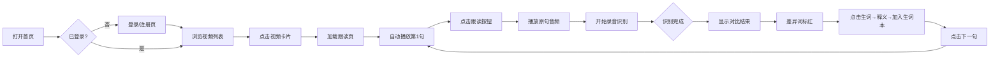

# ShadowingMaster MVP PRD

状态：已确认（2026-07-30）

## 核心需求

为成人英语学习者提供一个手机网页版的英语跟读训练工具，通过YouTube短视频 + 逐句气泡字幕 + 生词高亮 + 语音跟读对比，帮助用户提升口语流利度和听力。

## 验证目标

用户能流畅完成「注册/登录 → 选视频 → 播放句子 → 点击跟读 → 录音识别 → 看到对比结果 → 收藏生词 → 查看生词本」的完整闭环，且愿意连续跟读3句以上。

## 核心功能（MVP范围）

1. **用户注册/登录**：
   - 邮箱 + 密码注册/登录
   - JWT Token 认证
   - 未登录用户可浏览视频列表，但跟读记录和生词本需登录
2. **视频列表页**：展示已爬取的YouTube视频卡片（封面、标题、时长），点击进入跟读页
3. **逐句跟读页**：
   - 视频播放区（自动播放到当前句起止时间）
   - 双语气泡字幕（英文 + 中文翻译，可切换显示模式：仅英/仅中/双语）
   - 生词高亮（超出5000常用词表的词标红/加底色）
   - 工具栏：播放/暂停、上一句/下一句、跟读按钮、字幕语言切换
4. **语音跟读对比**：
   - 点击「跟读」→ 播放原句 → 开始录音（Web Speech API）
   - 识别结果显示在气泡下方，与原文字逐词对比，差异词标红
5. **视频后台爬取**：
   - 管理员/后台脚本用yt-dlp从YouTube下载视频
   - 自动生成英文字幕（whisper或yt-dlp自带字幕）
   - 自动生成中文字幕（调用翻译API如LibreTranslate或Google Translate）
   - 提取句子级别的时间戳和文本（中英对齐）
   - 标注生词（对比5000常用词表）
6. **生词本**：
   - 点击高亮生词 → 弹出释义（调用免费词典API如FreeDictionary）+ 「加入生词本」按钮
   - 生词本页面：列表展示收录的生词 + 点击跳回原视频/句子位置
   - 数据存数据库，关联到登录用户
7. **学习记录**：
   - 记录每视频跟读过的句子数、最后一次学习位置
   - 数据存数据库，关联到登录用户

## 明确不做

- ❌ 多平台爬取（B站、TED等）
- ❌ 发音打分/AI语音评测（MVP只做文本对比）
- ❌ 视频上传（仅YouTube爬取）
- ❌ 社交功能（排行榜、分享）
- ❌ 离线缓存（PWA）
- ❌ 句子收藏（v2）
- ❌ 移动端原生App
- ❌ 生词复习计划/记忆算法（v2）
- ❌ OAuth第三方登录（v2）

## 核心功能流程图



## UI线框图

### 屏幕0：登录/注册页

```
+----------------------------------+
|                                  |
|       ShadowingMaster            |
|      英语口语跟读训练             |
|                                  |
|  ┌----------------------------┐  |
|  │  邮箱: [                 ] │  |
|  │  密码: [                 ] │  |
|  │                            │  |
|  │     [    登  录    ]       │  |
|  │                            │  |
|  │     [    注  册    ]       │  |
|  └----------------------------┘  |
|                                  |
+----------------------------------+
```
交互：输入邮箱密码 → 登录成功 → 跳转视频列表页

### 屏幕1：视频列表页

```
+----------------------------------+
|  ShadowingMaster    [👤]  [📖]   |
+----------------------------------+
|                                  |
|  ┌----------------------------┐  |
|  │ [视频封面图]               │  |
|  │                            │  |
|  │  标题: How to Learn Fast   │  |
|  │  时长: 2:34  |  12句      │  |
|  │  上次学到: 第5句           │  |
|  └----------------------------┘  |
|                                  |
|  ┌----------------------------┐  |
|  │ [视频封面图]               │  |
|  │                            │  |
|  │  标题: Daily English #23   │  |
|  │  时长: 1:45  |  8句       │  |
|  └----------------------------┘  |
|                                  |
|  ┌----------------------------┐  |
|  │ [视频封面图]               │  |
|  │                            │  |
|  │  标题: Interview Tips      │  |
|  │  时长: 3:12  |  15句      │  |
|  └----------------------------┘  |
|                                  |
+----------------------------------+
```
交互：上下滑动浏览视频卡片 → 点击卡片进入跟读页；点击[👤]进入个人中心；点击[📖]进入生词本

### 屏幕2：跟读页

```
+----------------------------------+
|  [←]  How to Learn Fast    [📖]  |
+----------------------------------+
|                                  |
|  ┌----------------------------┐  |
|  │                            │  |
|  │      [视频播放区]          │  |
|  │                            │  |
|  │     ▶  (自动播放到当前句)   │  |
|  │                            │  |
|  └----------------------------┘  |
|  [英中 ▼]  字幕语言切换          |
|  ───────────────────────────────  |
|                                  |
|  ┌---------------------------┐   |
|  │ The quick brown fox      │   |
|  │ 一只敏捷的棕色狐狸        │   |  ← 已读句（灰色）
|  └---------------------------┘   |
|                                  |
|  ┌---------------------------┐   |
|  │ jumps over the lazy dog  │   |
|  │ 跳过了一只懒狗            │   |  ← 当前句（高亮边框）
|  │                          │   |
|  │ 点击高亮词「lazy」弹出：  │   |
|  │ ┌---------------------┐  │   |
|  │ │ lazy /ˈleɪzi/       │  │   |
|  │ │ adj. 懒惰的          │  │   |
|  │ │ [✚ 加入生词本]       │  │   |
|  │ └---------------------┘  │   |
|  │                          │   |
|  │ [🎤 跟读]               │   |
|  │                          │   |
|  │ 识别: jumps over the    │   |  ← 跟读结果（差异词标红）
|  │         ~~lazy~~ dog    │   |
|  └---------------------------┘   |
|                                  |
|  ┌---------------------------┐   |
|  │ and runs into the forest │   |
|  │ 然后跑进了森林            │   |  ← 未读句（默认色）
|  └---------------------------┘   |
|                                  |
|  ───────────────────────────────  |
|                                  |
|  [⏮]  [⏯]  [⏭]  [🎤跟读]      |
+----------------------------------+
```
交互：
- 视频自动播放到当前句的时间范围，播完暂停
- 字幕语言切换：英中/仅英/仅中
- 点击高亮生词 → 弹出释义弹窗 → 可加入生词本
- 点击「跟读」→ 先重播原句 → 开始录音 → 识别结果显示在气泡下方
- 识别文本与原文字逐词对比，缺失/错误的词标红
- 点击「下一句」→ 滚动到下一个气泡，视频跳转到对应时间
- 上下滑动浏览字幕列表

### 屏幕3：生词本页

```
+----------------------------------+
|  [←]  生词本               [⚙]   |
+----------------------------------+
|                                  |
|  ┌---------------------------┐   |
|  │ lazy                      │   |
|  │ /ˈleɪzi/  adj. 懒惰的     │   |
|  │ 📹 How to Learn Fast      │   |
|  │ 第3句                     │   |
|  └---------------------------┘   |
|                                  |
|  ┌---------------------------┐   |
|  │ appreciate                │   |
|  │ /əˈpriːʃieɪt/ v. 欣赏     │   |
|  │ 📹 Daily English #23      │   |
|  │ 第5句                     │   |
|  └---------------------------┘   |
|                                  |
|  ┌---------------------------┐   |
|  │ phenomenon                │   |
|  │ /fəˈnɒmɪnən/ n. 现象      │   |
|  │ 📹 Interview Tips         │   |
|  │ 第2句                     │   |
|  └---------------------------┘   |
|                                  |
+----------------------------------+
```
交互：
- 列表展示所有加入生词本的单词
- 点击生词条目 → 跳转到对应视频的对应句子位置

## UI规范

（2026-07-30 定稿：Slice 0 选定变体 A · 暖橙卡片。token 事实源 = `frontend/src/theme.ts`，组件只允许取 token，禁止手写散落色值/字号/间距）

**布局结构**
- 移动端优先，桌面浏览器收窄为 480px 居中栏；页面左右安全边距 16px
- 视频列表：竖向卡片流；跟读页：竖向气泡字幕列表（已读灰底 / 当前句主色边框+浅橙底 / 未读白底）
- 底部固定工具栏（毛玻璃背景）：上一句 / 下一句 / 跟读（主色胶囊按钮）
- 生词释义：居中模态弹窗

**色彩**
| 用途 | 值 |
|---|---|
| 页面底色 | `#FFF8F0` 暖米 |
| 卡片/气泡 | `#FFFFFF` |
| 主色（品牌/主按钮/当前句） | `#FF7F50` 珊瑚橙，浅底 `#FFF0E6` |
| 正文 / 次要文字 | `#2D2D2D` / `#666666` |
| 描边分隔 | `#F0E6DC` |
| 生词/差异词 | `#E74C3C`（+ 8% 透明度底色） |
| 跟读正确词 | `#27AE60` |
| 已读句底色 | `#F5F5F5` |

**字体**
- 系统字体栈：`-apple-system, "PingFang SC", "Helvetica Neue", "Segoe UI", Roboto, "Noto Sans SC"`，零外部字体依赖
- 字号阶梯：品牌 28 / 页标题 20 / 卡片标题 18 / **英文字幕句 17（跟读核心，最大正文）** / 正文 16 / 中文字幕·次要 14 / 元信息 13 / 角标 12
- 字重：常规 400 / 半粗 600 / 粗 700 / 特粗 800（品牌）
- 行高：字幕句 1.7，正文 1.6

**间距**：4 / 8 / 12 / 16 / 20 / 24 / 32 八级刻度；**圆角**：8 / 12 / 16 / 20 / 999（胶囊）；**阴影**：卡片 `0 4px 20px rgba(0,0,0,0.06)`

**组件约定**
- 主按钮：珊瑚橙实心 + 胶囊圆角；次按钮：白底 + 浅描边
- 字幕语言切换：胶囊 chip 组（选中实心主色）
- 生词高亮：红色加粗 + 浅红底色，可点击；跟读对比：正确绿色常规、错误红色加粗删除线

## 技术栈

- 前端：Vite + React + TypeScript（移动端优先的响应式布局）
- 后端：FastAPI + SQLite
- 认证：JWT（PyJWT），密码哈希（bcrypt）
- 视频爬取：yt-dlp（下载视频 + 字幕）
- 语音识别：Web Speech API（浏览器原生，无需后端）
- 字幕翻译：LibreTranslate 或 Google Translate API（中英对齐）
- 生词标注：5000常用词表（JSON文件）对比过滤
- 词典释义：Free Dictionary API
- 部署：单 VPS，前端静态文件 + 后端单进程 + SQLite

## 切片计划（阶段 4 · 2026-07-30 待确认）

Slice 0（交互原型）已完成：三变体对比 → 选定 A · 暖橙卡片 → 收口转正，UI 规范见上节。

### 第 1 片（骨架）：真实视频按句播放
- 做什么：用 yt-dlp 手动下载 1 个真实 YouTube 短视频 + 英文自动字幕，一次性脚本解析字幕生成带真实时间戳的 sentences 入库；后端加 `/media` 静态服务；前端跟读页用 `<video>` 替换占位块——切句时 seek 到 start_time，播放到 end_time 自动暂停
- 不做什么：自动爬取管线、中文字幕、whisper、多视频批量
- 写死/stub：只处理这 1 个视频；字幕来源 = yt-dlp 自动字幕（不行就手工 srt）
- 验证方式：E2E 单用例 — 打开跟读页视频真实播放，点"下一句"播放头跳转

### 后续切片
| # | 切片 | 扩展维度 | 验证方式 |
|---|------|----------|----------|
| 2 | 爬取脚本 CLI（`fetch_video.py <youtube_url>`） | 手动跑通 下载→字幕→入库 一条龙 | 跑脚本后新视频出现在列表页且可跟读 |
| 3 | 中文字幕 | 翻译管线写入 chinese_text | 字幕切"仅中文"有内容 |
| 4 | 生词标注真词表 | 5000 常用词 JSON 替换前端写死 stub | 已知生词被高亮、常用词不高亮 |
| 5 | 播放位置记忆 | 重进跟读页恢复到上次句位（切句静默上报 last_index，无进度 UI；2026-07-30 用户重定义，砍"学习进度"叙事） | E2E：切句后重进落在原句位 |
| 6 | 生词本跳回原句 | 词条点击跳回对应视频/句子（后端已存 video_id/sentence_id） | E2E：点击词条落到原句 |

### 候选清单（计划外，暂不做）
- 发音打分 / AI 语音评测（PRD 明确不做）
- 视频下载进度展示、失败重试加固
- 深色模式、动效打磨

## 关键决策清单（grill收敛结果）

| 决策项 | 结论 |
|---|---|
| 目标用户 | 成人通用英语学习者（初中级为主） |
| 界面形态 | 手机浏览器网页版（响应式） |
| 视频来源 | YouTube爬取（yt-dlp），MVP仅支持YouTube |
| 生词标注 | 超出5000常用词表的词自动高亮 |
| 跟读交互 | Web Speech API识别 + 文本逐词对比，差异标红 |
| 用户系统 | 邮箱+密码注册登录，JWT认证；数据存数据库关联用户 |
| 多语言字幕 | 中英双语字幕，支持切换显示模式（英中/仅英/仅中） |
| 生词记录 | 生词本：点击高亮词→释义→加入→可跳回原视频/句子 |
